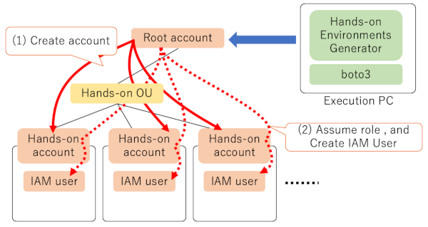

# Hands-on environments generator
It is python tool what generates Hands-on environments. As a prerequisite to the execution of this tool, AWS Organizations environment is required.
## Description
This tool provides support functions for generating Hands-on environments. This tool provides following functions.
1. Generate member accounts in AWS Organizations.
1. Generate IAM user(s) in each member account.

This tool requires permissions what allows to create a member account on the AWS Organizations root account, and allow to  Assume Role to the created account's Administorator policy.

## Demo
under construction.

## Requirement
This tool requires following modules and permissions.
- Executing environment for This tools
    - python
    - AWS SDK for Python(Boto3)
- AWS Environment
    - AWS Organization
        - Prepare a OU(Organization Unit) for workshop
## Install
### (1)git clone
### (2)Configure aws cli

## Usage

## Contribution

## Licence

[MIT](https://github.com/tcnksm/tool/blob/master/LICENCE)

## Author

[tcnksm](https://github.com/tcnksm)